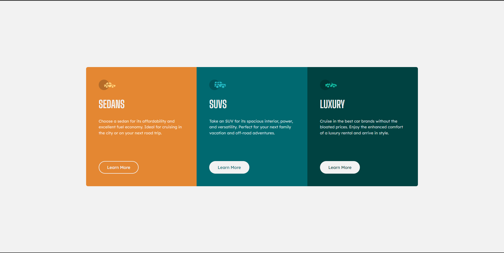

# Frontend Mentor - 3-column preview card component solution

This is a solution to the [3-column preview card component challenge on Frontend Mentor](https://www.frontendmentor.io/challenges/3column-preview-card-component-pH92eAR2-). Frontend Mentor challenges help you improve your coding skills by building realistic projects.

## Table of contents

- [Overview](#overview)
  - [The challenge](#the-challenge)
  - [Screenshot](#screenshot)
  - [Links](#links)
- [My process](#my-process)
  - [Built with](#built-with)
  - [Continued development](#continued-development)
- [Author](#author)

## Overview

### The challenge

Users should be able to:

- View the optimal layout depending on their device's screen size
- See hover states for interactive elements

### Screenshot

### Links

- Live Site URL: [https://04-3-column-previw-card-component.vercel.app/]

## My process

### Built with

- CSS custom properties
- Flexbox
- Mobile-first workflow
- [React Typescript](https://www.typescriptlang.org/docs/handbook/react.html) - JS library
- [Bootstrap](https://getbootstrap.com/docs/5.2/getting-started/introduction/) - For styles

### Continued development

I want to continue to improve my CSS skills and learn more about ReactTs.

## Author

- Frontend Mentor - [@Marcus-Giglio](https://www.frontendmentor.io/profile/Marcus-Giglio)
- Linkedin - [Marcus Giglio](https://www.linkedin.com/in/marcus-g-514b51175/)
